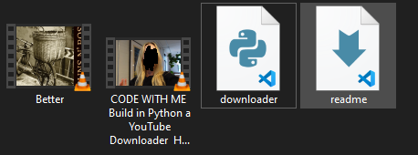

# YOUTUBE DOWNLOADER EM PYTHON

## Objetivo

O objetivo deste projeto é poder fazer download de vídeos do YouTube de maneira fácil, rápida e sem depender de ferramentas em páginas da internet que, muitas vezes, nos redirecionam para domínios de confiança duvidosa sem nossa permissão.

## Funcionamento

O usuário deve inserir o link do vídeo que deseja baixar e, depois de ver se o título se refere ao vídeo esperado, digitar "s" para confirmar a intenção de fazer o download.

O vídeo é baixado na pasta onde o arquivo .py está localizado, e uma mensagem de sucesso é apresentada.

## Recursos utilizados
<ul>
<li><a href="https://pytube.io/en/latest/index.html">Biblioteca pytube;</a></li>
<li><a href="https://youtu.be/EMlM6QTzJo0">[inspiração] Vídeo do canal Tiff in Tech.</a></li>